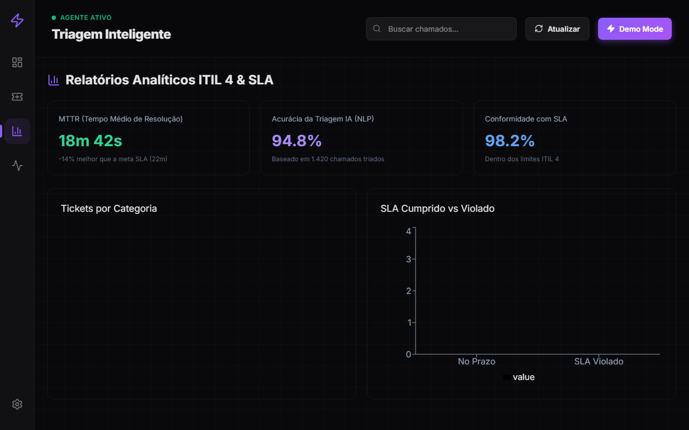

<div align="center">

# ⚡ ITSM Triagem Inteligente (Agente Autônomo de Suporte IA & NLP)

**Sistema de Gerenciamento de Serviços de TI impulsionado por Inteligência Artificial e Processamento de Linguagem Natural (NLP)**


</div>

---



## Sobre o Projeto

Plataforma de **IT Service Management (ITSM)** autônoma que aplica **Inteligência Artificial e Processamento de Linguagem Natural (NLP)** na classificação semântica de chamados técnicos. Em ambientes corporativos complexos, equipes de suporte perdem tempo triando chamados manualmente. Este sistema resolve o gargalo atuando como um **Agente Autônomo de Nível 1**, analisando o contexto textual e diagnosticando incidentes em tempo real.

### Fluxo Neural do Agente IA

1. **Recepção Semântica:** Recebe a descrição textual e contexto operacional do problema técnico
2. **Classificação Autônoma:** O motor de NLP identifica a Categoria (Rede, Hardware, Sistema, Segurança) e Prioridade (Crítica, Média, Baixa) via ponderação semântica
3. **Cálculo de Confiança Neural:** Emite o **IA Confidence Score** (0 a 100%) indicando a certeza do diagnóstico sem intervenção humana
4. **Alocação Inteligente:** Persiste o incidente com diagnóstico gerado pela IA no banco de dados e exibe em um painel Kanban reativo


---

## 📌 Destaque para Recrutadores & Liderança Técnica

Este projeto demonstra a aplicação de práticas modernas de **Engenharia de Software, Padrões de Projeto e Foco em Eficiência Operacional**:

* 💼 **Impacto no Negócio (ROI & MTTR):** Em centrais de serviço corporativas, o tempo de triagem manual consome até 30% do ciclo de vida de um chamado. Esta solução automatiza o encaminhamento inicial, reduzindo o **MTTR (Mean Time to Resolve)** e aumentando o **FCR (First Contact Resolution)**.
* 🏗️ **Design Patterns & Desacoplamento:** O motor de NLP utiliza o *Strategy Pattern* (`backend/triage.py`), permitindo substituir o algoritmo atual por modelos de Machine Learning (BERT, Scikit-Learn) ou LLMs via API (OpenAI/Gemini) **sem alterar os controladores da API ou o frontend**.
* 🛡️ **Qualidade & Segurança de Tipos:** Código backend fortemente tipado com **Python 3.11+ e Pydantic v2**, garantindo a validação de contratos da API, aliado a um frontend reativo em **React 19 e TypeScript/Vite**, eliminando erros comuns em tempo de execução.
* ⚡ **Pronto para Produção:** Configuração completa com CORS dinâmico, datas em UTC com timezone-aware (evitando bugs de fuso horário em servidores em nuvem) e orquestração via Docker Compose.

---

## Funcionalidades

| Feature | Descrição |
|---------|-----------|
| 🤖 **Triagem Automática** | Motor de NLP com weighted keyword scoring: 4 categorias e 3 prioridades |
| 📊 **Dashboard Kanban** | Colunas Novo → Em Atendimento → Resolvido com fluxo contínuo |
| 🎯 **Score de Confiança** | Barra de progresso indicando o percentual de certeza por ticket |
| 📈 **Métricas com Trends** | Cards com indicadores de tendência (+/-%) em tempo real |
| 🔍 **Busca em Tempo Real** | Filtro instantâneo por descrição, solicitante ou categoria |
| 📋 **Log de Atividade** | Timeline lateral com histórico de ações do sistema |
| 🎲 **Dados de Demo** | Seed com 12 cenários realistas de suporte corporativo |
| 🐳 **Containerizado** | Docker Compose para deploy de ambiente completo |

---

## Motor de Triagem e Arquitetura Desacoplada

O motor (`backend/triage.py`) foi **desacoplado intencionalmente** para facilitar futuras evoluções:

```python
resultado = triagem_automatica("O roteador caiu")
# → ResultadoTriagem(categoria="Rede", prioridade="Crítica", confianca=0.92)

# Substituível por ML/LLM sem alterar a API:
# 1. TF-IDF + Random Forest (scikit-learn)
# 2. BERT fine-tuned (transformers)
# 3. LLM API call (OpenAI/Gemini)
```

---

## API Endpoints

| Método | Rota | Descrição |
|--------|------|-----------|
| `POST` | `/tickets` | Cria ticket com triagem automática |
| `GET` | `/tickets` | Lista todos os tickets |
| `PATCH` | `/tickets/{id}` | Atualiza status/prioridade/categoria |
| `DELETE` | `/tickets/{id}` | Remove um ticket |
| `GET` | `/stats` | Métricas agregadas do dashboard |
| `POST` | `/seed` | Popula banco com dados de demonstração |

Swagger UI: `http://localhost:8000/docs`

---

## Stack

| Camada | Tecnologia |
|--------|-----------|
| **Backend** | Python 3.11 · FastAPI · SQLAlchemy ORM · Pydantic v2 · SQLite |
| **Frontend** | React 19 · Vite 8 · Tailwind CSS 4 · Lucide React · Axios |
| **DevOps** | Docker · Docker Compose · Git |

---

## Como Executar

### Docker (recomendado)
```bash
git clone https://github.com/Christophep52/itsm-triagem-inteligente.git
cd itsm-triagem-inteligente
docker-compose up --build
```

### Local
```bash
# Backend
cd backend && pip install -r requirements.txt
uvicorn main:app --reload --port 8000

# Frontend
cd frontend && npm install && npm run dev
```

**Frontend:** http://localhost:5173 · **API Docs:** http://localhost:8000/docs
