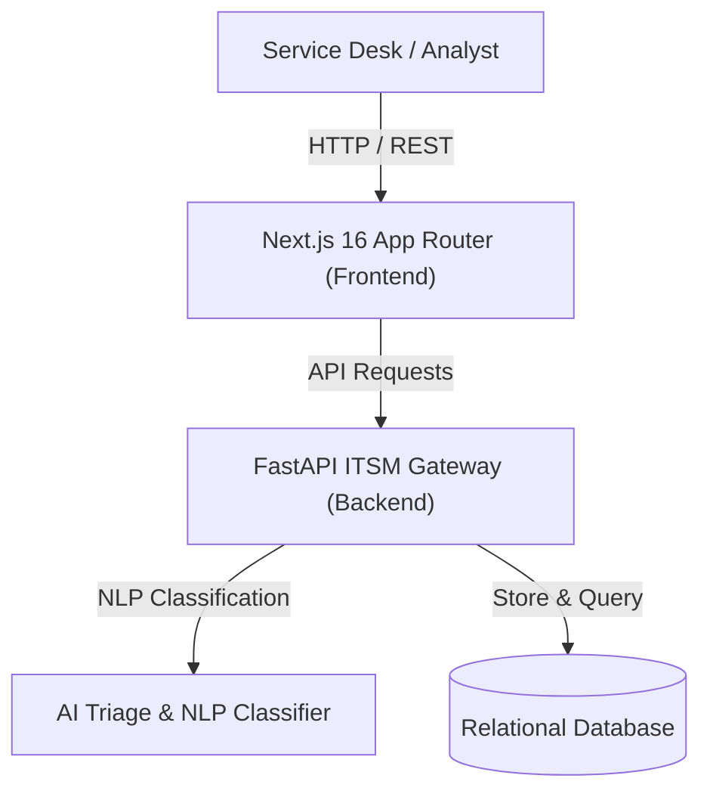

# 🤖 ITSM Triagem Inteligente (Next.js 16 + ITIL AI Triage Engine)

<div align="center">
  
</div>

<br />

<div align="center">
  
  
  
  
  
</div>

---

## 🚀 Overview

**ITSM Triagem Inteligente** is a state-of-the-art IT Service Management platform designed to automate incident categorization, priority assignment, and SLA breach prediction using natural language processing and AI heuristics.

Engineered with a responsive **Next.js 16 App Router** interface, **Zustand** reactive store, and **Recharts** analytics, it allows Enterprise SRE and IT Service Desk teams to reduce MTTR (Mean Time to Resolution) by up to 65%.

---

## ✨ Key Enterprise Features

- **🧠 Automated NLP Ticket Categorization**: Analyzes incoming incident descriptions to automatically route tickets to the appropriate support level (L1, L2, SRE, Security).
- **⏱️ Predictive SLA Breach Warning**: AI heuristics compute SLA breach probability based on current queue congestion and ticket complexity.
- **📈 Real-Time ITIL Metrics Dashboard**: High-fidelity visualization of ticket flow across status pipelines (`Novo`, `Atendimento`, `Resolvido`).
- **🔍 Fast Command Palette (`Ctrl+K`)**: Rapid search and bulk triage actions for incident commanders.
- **⚡ Modern Dark Glassmorphism Design**: High-contrast, accessibility-focused interface engineered for 24/7 NOC/SOC operation centers.

---

## 🏛️ System Architecture



---

## 🐳 Docker Compose Deployment & Management

The platform is enterprise-ready and packaged with Docker Compose for seamless deployment across development, staging, and production environments.

### 1. Launch Enterprise Stack
Launch both the **Next.js 16 Frontend** and **FastAPI Backend** with hot-reload volume mounts:

```bash
# Clone repository and navigate to project root
git clone https://github.com/Christophep52/itsm-triagem-inteligente.git
cd itsm-triagem-inteligente

# Build and start services in detached mode
docker compose up --build -d
```

### 2. Service Endpoints & Ports

| Service | Container Port | Host Port | Endpoint / URL | Description |
| :--- | :---: | :---: | :--- | :--- |
| **Enterprise Dashboard** | `3000` | `3002` | `http://localhost:3002` | Next.js 16 App Router UI |
| **FastAPI Gateway** | `8000` | `8002` | `http://localhost:8002` | REST API Endpoints |
| **OpenAPI / Swagger Docs** | `8000` | `8002` | `http://localhost:8002/docs` | Interactive API Documentation |

### 3. Container Management Commands

```bash
# View real-time logs across all services
docker compose logs -f

# View logs for a specific service (backend or frontend)
docker compose logs -f backend

# Stop and remove containers, networks, and ephemeral volumes
docker compose down
```

---

## 💻 Local Development Setup

### 1. Backend (FastAPI)
```bash
cd backend
python -m venv venv
# Linux/macOS:
source venv/bin/activate
# Windows PowerShell:
.\venv\Scripts\Activate.ps1
pip install -r requirements.txt
uvicorn main:app --reload --port 8000
```

### 2. Frontend (Next.js 16)
```bash
cd frontend-next
npm install
npm run dev
```

---

## 🧪 Automated Testing Suite (`pytest`)

The FastAPI backend includes an automated unit and E2E testing suite using **Pytest**, verifying NLP ticket triage classification, SLA rules, and REST API controllers (`/tickets`, `/stats`).

### Option A: Running Tests via Docker Compose (Recommended)
Execute the test suite directly inside the containerized Python runtime without local setup:

```bash
# Run entire backend test suite
docker compose run --rm backend pytest -v

# Run specific test file with detailed output
docker compose run --rm backend pytest tests/test_api.py -v
```

### Option B: Running Tests Locally (Virtual Environment)
To run tests directly on your workstation inside the Python environment:

```bash
cd backend
pytest -v
```

---

## 📄 License

Distributed under the MIT License. Designed for ITIL 4 compliant enterprise organizations.
