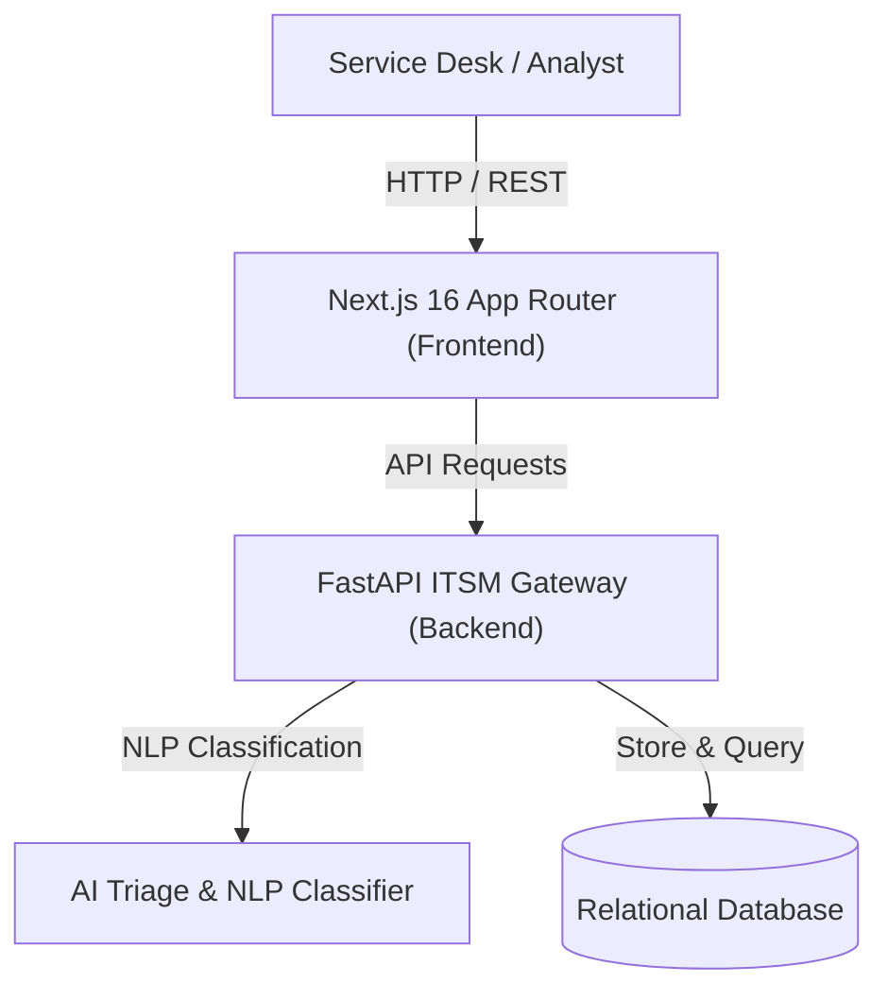

# 🤖 ITSM Triagem Inteligente (Next.js 16 + ITIL AI Triage Engine)

<div align="center">
  
</div>

<br />

<div align="center">
  
  
  
  
  
</div>

---

## 🚀 Overview

**ITSM Triagem Inteligente** is a state-of-the-art IT Service Management platform designed to automate incident categorization, priority assignment, and SLA breach prediction using natural language processing and AI heuristics.

Engineered with a responsive **Next.js 16 App Router** interface, **Zustand** reactive store, and **Recharts** analytics, it allows Enterprise SRE and IT Service Desk teams to reduce MTTR (Mean Time to Resolution) by up to 65%.

---

## ✨ Key Enterprise Features

- **🧠 Automated NLP Ticket Categorization**: Analyzes incoming incident descriptions to automatically route tickets to the appropriate support level (L1, L2, SRE, Security).
- **⏱️ Predictive SLA Breach Warning**: AI heuristics compute SLA breach probability based on current queue congestion and ticket complexity.
- **📈 Real-Time ITIL Metrics Dashboard**: High-fidelity visualization of ticket flow across status pipelines (`Novo`, `Atendimento`, `Resolvido`).
- **🔍 Fast Command Palette (`Ctrl+K`)**: Rapid search and bulk triage actions for incident commanders.
- **⚡ Modern Dark Glassmorphism Design**: High-contrast, accessibility-focused interface engineered for 24/7 NOC/SOC operation centers.

---

## 🏛️ System Architecture



---

## 🛠️ Quick Start (Docker Compose)

Launch the complete ITSM enterprise stack with one command:

```bash
# Clone the repository
git clone https://github.com/Christophep52/itsm-triagem-inteligente.git
cd itsm-triagem-inteligente

# Launch full stack (Next.js 16 + FastAPI)
docker compose up --build -d
```

Access the applications:
- **Enterprise ITSM Dashboard**: `http://localhost:3000`
- **FastAPI Backend Documentation**: `http://localhost:8000/docs`

---

## 💻 Local Development Setup

### 1. Backend (FastAPI)
```bash
cd backend
python -m venv venv
source venv/bin/activate
pip install -r requirements.txt
uvicorn main:app --reload --port 8000
```

### 2. Frontend (Next.js 16)
```bash
cd frontend-next
npm install
npm run dev
```

---

## 📄 License

Distributed under the MIT License. Designed for ITIL 4 compliant enterprise organizations.
