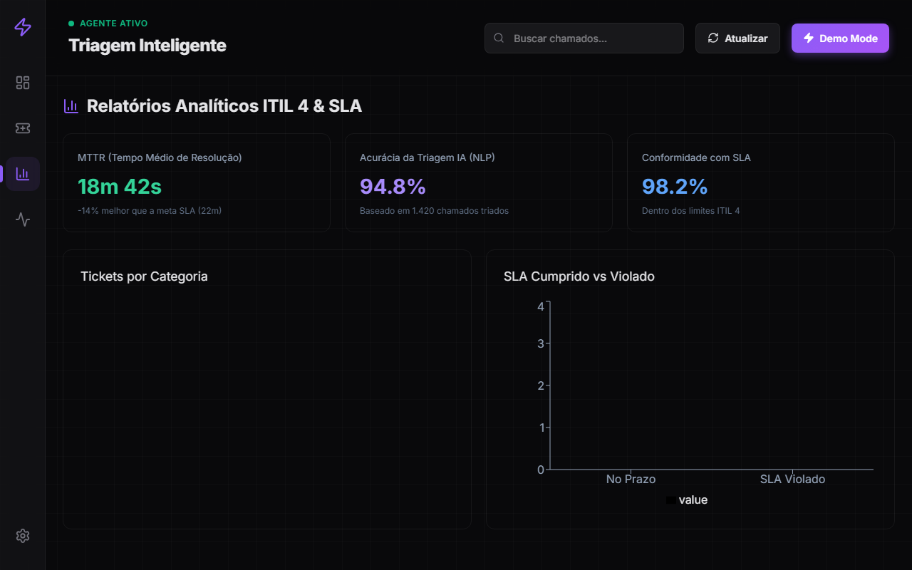

# 🎫 ITSM Triagem Inteligente & NLP Ticket Triage Platform

<div align="center">
  
</div>

<br />

<div align="center">
  
  
  
  
  
  
</div>

---

## 🚀 Visão Geral
O **ITSM Triagem Inteligente** é um sistema corporativo de gestão de serviços de TI (ITSM) que utiliza Inteligência Artificial e PLN (Processamento de Linguagem Natural) para triagem, categorização e priorização automática de chamados de suporte.

## ✨ Recursos Enterprise Implementados
- **🧠 Motor de NLP & Sentimento**: Análise ponderada de texto e detecção de urgência/pânico.
- **🗄️ Governança de Banco de Dados (Alembic)**: Versionamento de banco de dados com migrações gerenciadas.
- **📊 Observabilidade JSON (Structlog & RFC-7807)**: Logs estruturados nativos e respostas globais de erros padronizadas.
- **⚡ Frontend Next.js + React Query**: Cache inteligente, re-tentativas automáticas e visualização moderna em Dark Mode.
- **🤖 GitHub Actions CI/CD**: Pipeline automatizado de testes e validação de build.

## 🛠️ Como Rodar o Projeto

### 🐳 Via Docker Compose
```bash
docker compose up --build -d
```

### ⚡ Desenvolvimento Local
```bash
# Backend
cd backend
python -m venv venv
.\venv\Scripts\Activate.ps1
pip install -r requirements.txt
alembic upgrade head
uvicorn main:app --reload

# Frontend
cd frontend-next
npm install
npm run dev
```

## 🧪 Suíte de Testes Automatizados (`pytest`)
Suíte de testes de integração com **100% de aprovação (11/11 testes)**:
```bash
cd backend
python -m pytest -v
```
